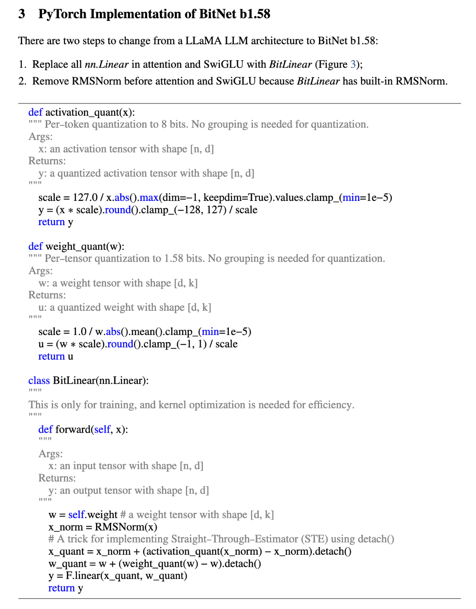
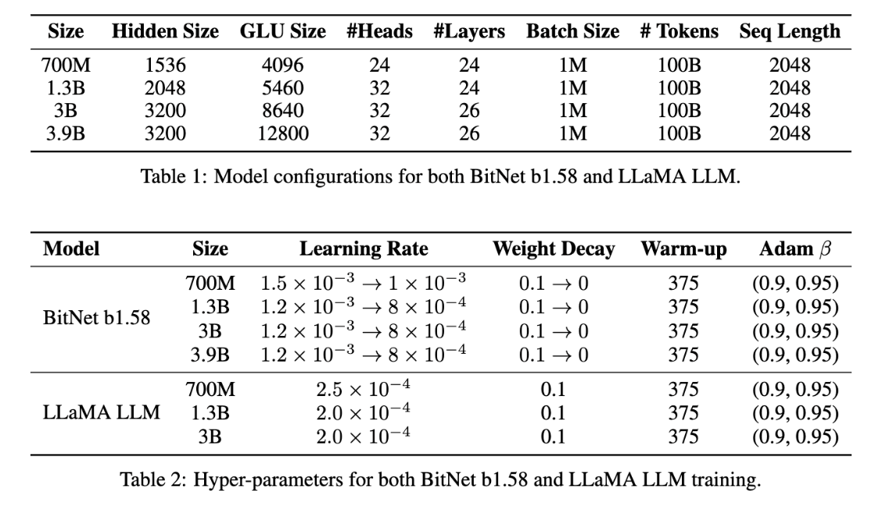
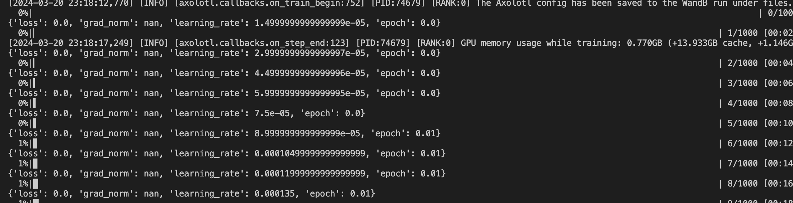

# 1.58 Bit Llama Model
Initial implementation of 1.58-bit Llama Model following the reference paper: https://github.com/microsoft/unilm/blob/master/bitnet/The-Era-of-1-bit-LLMs__Training_Tips_Code_FAQ.pdf

In this paper, they outline the code changes necessary to make 1.58 bit ternary quantized training work. In this repo + my transformers fork, I have implemented the changes necessary to make this work. The main changes are in the `transformers` repo, where I have added the `BitLlamaModel` and `BitLlamaForCausalLM` classes. 





See my [transformers repo](https://github.com/bjoernpl/transformers/tree/add_bitllama/src/transformers/models/bitllama), the [uploaded initialized model](https://huggingface.co/bjoernp/micro-bitllama) or `configuration_bitllama.py` and `modeling_bitllama.py` for the modeling implementation.

I've also included a basic axolotl toy pretraining config (`pretraining_bitllama.yaml`) based on a small model that I initialized and [uploaded to HF](https://huggingface.co/bjoernp/micro-bitllama) with the modelling code. You can use this to test the training. Currently, the training is not working as expected as I'm getting nan grads:


## Installation
```bash
git clone git@github.com:bjoernpl/transformers.git@add_bitllama
cd transformers
pip install -e .
```

For optional training with axolotl, you can install the following:
```bash
git clone https://github.com/OpenAccess-AI-Collective/axolotl
cd axolotl

pip3 install packaging
pip3 install -e '.[flash-attn]'
```

## Changes to code:
The relevant changes are adding the following to the modeling code:
```python
def activation_quant(x):
    scale = 127.0 / x.abs().max(dim=-1, keepdim=True).values.clamp_(min=1e-5)
    y = (x * scale).round().clamp_(-128, 127) / scale
    return y


def weight_quant(w):
    scale = 1.0 / w.abs().mean().clamp_(min=1e-5)
    u = (w * scale).round().clamp_(-1, 1) / scale
    return u


class BitLinear(nn.Linear):
    def __init__(self, in_features, out_features, bias=True):
        super().__init__(in_features, out_features, bias=bias)
        self.norm = LlamaRMSNorm(in_features)

    def forward(self, x):
        w = self.weight
        x_norm = self.norm(x)
        x_quant = x_norm + (activation_quant(x_norm) - x_norm).detach()
        w_quant = w + (weight_quant(w) - w).detach()
        return F.linear(x_quant, w_quant)
```
Also changing as the paper says all F.linear to BitLinear in the attention layers.

## Notes
This is absolutely WIP and experimental. Contributions and ideas towards fixing the nan grads are welcome. This also does not include the custom kernels mentioned (but not described) in the paper.
